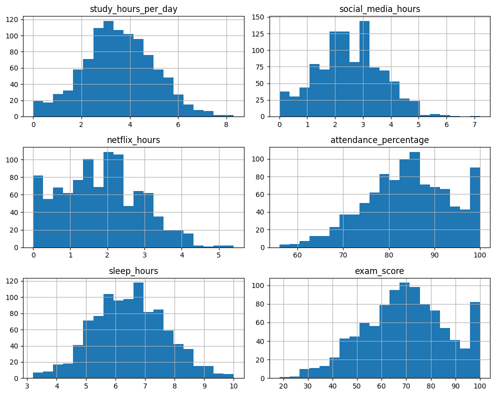
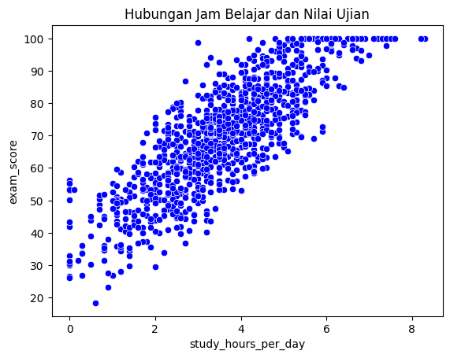
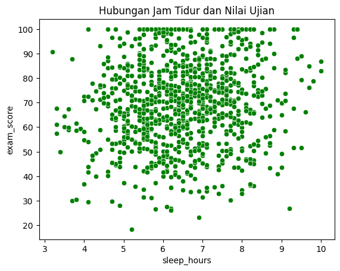
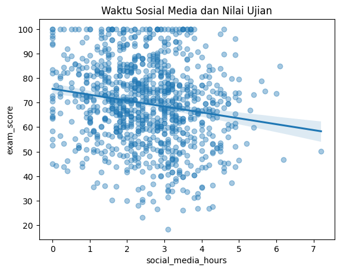
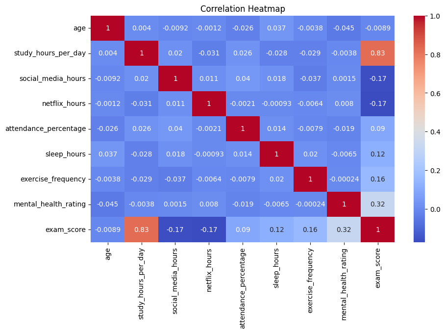
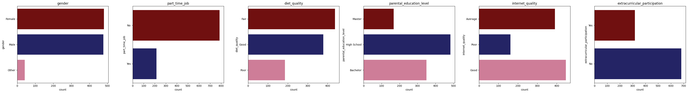

# Laporan Proyek Machine Learning - Ratu Chairunisa

## Domain Proyek

Dalam dunia pendidikan, peningkatan performa akademik siswa telah lama menjadi fokus utama institusi dan pendidik. Salah satu pendekatan yang semakin populer untuk memahami faktor-faktor yang memengaruhi performa siswa adalah melalui educational data mining (EDM), yaitu eksplorasi data pendidikan menggunakan teknik analitik dan machine learning (ML).

Berdasarkan penelitian yang dilakukan oleh Aljaffer, Almadani, AlDughaither, dkk. (2024) dalam artikel berjudul "Dampak kebiasaan belajar dan faktor pribadi terhadap prestasi akademik mahasiswa kedokteran", teridentifikasi bahwa gaya hidup dan faktor sosial memainkan peran krusial dalam menentukan kinerja akademik mahasiswa. Lebih lanjut, studi Jafari et al. menunjukkan adanya perbedaan signifikan dalam kebiasaan belajar antara siswa asli dan siswa asrama, di mana siswa asli cenderung memiliki kebiasaan yang lebih superior. Temuan ini diperkuat oleh Jouhari et al. yang menyoroti skor lebih rendah pada siswa asrama dalam aspek sikap, strategi ujian, pemilihan gagasan utama, dan konsentrasi. Curcio G et al. juga menegaskan bahwa mahasiswa dengan pola tidur yang teratur dan adekuat cenderung mencapai Rata-rata Nilai (GPA) yang lebih tinggi. Sementara itu, faktor gaya hidup seperti menonton televisi dan mendengarkan musik dinilai memiliki dampak minimal terhadap nilai akademik, namun aplikasi media sosial, termasuk WhatsApp, Facebook, dan Twitter, terbukti menjadi distraktor yang signifikan selama proses belajar.

Masalah ini penting diselesaikan karena dengan mengetahui faktor-faktor gaya hidup yang paling memengaruhi performa akademik, institusi pendidikan dapat merancang intervensi yang lebih tepat sasaran untuk meningkatkan prestasi siswa.

**Referensi:**
Aljaffer, M.A., Almadani, A.H., AlDughaither, A.S. et al. _The impact of study habits and personal factors on the academic achievement performances of medical students_. BMC Med Educ 24, 888 (2024) [https://doi.org/10.1186/s12909-024-05889-y](https://doi.org/10.1186/s12909-024-05889-y)

## Business Understanding
### Problem Statements

1. Bagaimana kebiasaan siswa sehari-hari (seperti pola tidur, durasi belajar, dan penggunaan media sosial) memengaruhi performa akademik mereka?
2. Fitur gaya hidup mana yang memiliki pengaruh paling signifikan terhadap nilai ujian akhir?

### Goals
1. Mengidentifikasi pola kebiasaan hidup siswa yang berkorelasi kuat dengan performa akademik.
2. Memprediksi nilai ujian akhir siswa berdasarkan data kebiasaan hidup mereka menggunakan algoritma machine learning. 

### Solution statements
Untuk mencapai tujuan ini, akan digunakan beberapa algoritma supervised learning seperti:
1. Linear Regression sebagai baseline model.
2. XGBoost Regressor sebagai model yang lebih kompleks, dengan proses hyperparameter tuning untuk meningkatkan performa.

Model-model ini akan dievaluasi menggunakan metrik regresi yang terukur, seperti:
- **Root Mean Squared Error (RMSE)**
- **Mean Absolute Error (MAE)**
- **R² Score**

## Data Understanding

Setelah dilakukan pengecekan kondisi awal dataset sebelum dilakukan pengolahan, diketahui bahwa dataset terdiri dari 1000 baris (entri) dan 16 kolom (fitur). Dataset tidak terindikasi adanya missing value dan data duplikat. Namun, terdapat outliers pada kolom-kolom numerik yang harus menjadi perhatian pada saat melakukan preparasi data.

source dataset yang digunakan: [Kaggle Dataset Repository](https://www.kaggle.com/datasets/jayaantanaath/student-habits-vs-academic-performance).

### **Fitur-fitur pada Dataset Students Habits vs Academic Performance** 
- **student_id:** merupakan ID unik yang berbeda-beda yang dimiliki setiap siswa
- **age:** merupakan umur siswa yang terdata
- **gender:** merupakan gender siswa (female, male, others)
- **study_hours_per_day:** merupakan lamanya waktu belajar yang dihabiskan dalam satu hari    
- **social_media_hours:** merupakan lamanya waktu menggunakan sosial media
- **netflix_hours:** merupakan durasi waktu yang dihabiskan untuk menonton dari app netflix
- **part_time_job:** merupakan fitur yang menyatakan status mahasiswa yang melakukan part time dan yang tidak melakukan part time
- **attendance_percentage:** merupakan persentase performa kehadiran siswa
- **sleep_hours:** merupakan durasi waktu yang digunakann siswa untuk tidur dan beristirahat
- **diet_quality:** merupakan informasi kualitas diet yang dilakukan siswa yang terdiri dari tiga kategori yaitu Fair, Good, dan Poor.
- **exercise_frequency:** merupakan frekuensi latihan terkait materi yang dilakukan siswa 
- **parental_education_level:** merupakan tingkat pendidikan yang ditempuh orang tua siswa yang terdiri dari tiga kategori yaitu High School, Bachelor, Master.
- **internet_quality:** merupakan informasi kualitas internet yang digunakan yang terdiri dari tiga kategori yaitu Good, Average, dan Poor.
- **mental_health_rating:** merupakan tingkat keparahan kesehatan mental yang dialami siswa
- **extracurricular_participation:** merupakan informasi terkait siswa yang mengikuti kegiatan ekstrakurikuler dan yang tidak.
- **exam_score:** merupakan informasi mengenai nilai ujian                   

### EDA (Exploratory Data Analysis)

- **Histogram fitur numerik:** untuk melihat distribusi pada fitur-fitur numerik 

- **Scatter Plot - "Jam Belajar" vs "Nilai Ujian":** untuk melihat hubungan antara fitur study_hours_per_day dengan fitur target (exam_score)

- **Scatter Plot– "Jam Tidur" vs "Nilai Ujian":** untuk melihat hubungan antara fitur sleep_hours dengan fitur target (exam_score)

- **Scatter/Reg Plot – "Media Sosial" vs "Nilai Ujian":** untuk melihat hubungan antara fitur social_media_hours dengan fitur target (exam_score)

- **Korelasi Fitur:** Heatmap korelasi untuk mengidentifikasi hubungan antar fitur numerik dengan target.

- **Bar Chart Data Kategorikal:** untuk memvisualisasikan jumlah data pada fitur-fitur kategorik.

## Data Preparation

Berikut ini adalah langkah-langkah dan teknik dalam data preparation yang dilakukan:

**1. Mengatasi Data Hilang (*Missing Value*)**: missing value diatasi menggunakan teknik imputasi dengan modus (data yang sering muncul), penggunaan modus sebagai metodek pengisian dikarenakan fitur tersebut bertipe kategori. Ini penting dilakukan agar tidak terdapat data kosong yang dapat mempengaruhi pada saat pemodelan.

**2. Mengatasi Outliers**: outliers diatasi menggunakan teknik **IQR (interquartile Range)** dengan memfilter data yang terdapat dalam rentang IQR, ini dilakukan agar mengurangi bias dan noise, dan meningkatkan performa model.

**3. Menerapkan fitur target**: menetapkan fitur exam_score sebagai fitur target. Ini penting dilakukan agar memperjelas tujuan prediksi.

**4. Membagi Data (*Splitting Data*)**: membagi data dengan proporsi 80:20, yaitu 80% data yang digunakan selama training, dan 20% digunakan pada saat testing. 
  * **X_train, y_train**: digunakan untuk melatih model agar mengenali pola dari data.
  * **X_test, y_test**: digunakan untuk menguji model pada data yang belum pernah dilihat sebelumnya.

Tahapan splitting data dilakukan untuk mencegah overfitting, melatih dan menguji model secara terpisah, menilai kemampuan model dalam memprediksi data baru.

**5. Feature Scaling (Melakukan Standarisasi & One Hot Encoding Sekaligus)**: 

* Melakukan standarisasi pada fitur-fitur numerik yang menghasilkan distribusi dengan mean 0 dan std 1.
* Melakukan Scaling dengan teknik One-Hot Encoding, yaitu mengubah kategori dalam kolom-kolom kategori ke bentuk biner(0/1). Ini penting dilakukan agar mesin bisa membaca data dan membantu model mampu bekerja secara optimal.

# Modeling

Dalam tahap ini, dilakukan proses pemodelan Machine Learning untuk memprediksi nilai ujian akhir siswa berdasarkan fitur-fitur kebiasaan hidup mereka. Beberapa algoritma regresi yang digunakan antara lain:

### Cara Kerja Algoritma Model Regresi Linear & XGBoost

**Cara Kerja Rregresi Linear**

* **Regresi Linear bekerja dengan** mencari hubungan linear terbaik antara fitur-fitur (jam belajar, jam tidur, jam bermain medsos, dll.) dan target (nilai ujian). Bayangkan kita mencoba menggambar sebuah 'garis lurus' (atau bidang datar jika fiturnya banyak) di antara semua titik data siswa sedemikian rupa sehingga garis tersebut menjadi representasi 'rata-rata' terbaik dari data.
* **Proses 'Belajar':** "Belajar" di sini berarti mencari nilai-nilai "Bobot" (koefisien β) dan "Nilai_Dasar" (intercept β0) yang paling akurat. Ia melakukannya dengan melihat semua data siswa yang ada dan mencoba meminimalkan total kesalahan prediksi. Kesalahan diukur sebagai selisih antara nilai ujian asli siswa dan nilai yang diprediksi oleh rumus. Tujuannya adalah membuat garis (atau bidang dalam banyak dimensi) sedekat mungkin dengan semua titik data.

**Cara Kerja XGBoost**

* **Tebakan Awal:** XGBoost mungkin memulai dengan menebak bahwa semua siswa akan mendapatkan nilai rata-rata. Tentu saja, tebakan ini banyak salahnya.
* **Pohon Pertama (Fokus pada Kesalahan):** Algoritma ini kemudian membangun 'pohon keputusan' (seperti diagram alur sederhana) pertama. Pohon ini tidak mencoba menebak nilai ujian, tetapi mencoba menebak seberapa besar kesalahan tebakan awal tadi untuk setiap siswa. Misalnya, pohon ini mungkin belajar: "Jika siswa belajar > 4 jam, tebakan awal mungkin terlalu rendah 5 poin," atau "Jika siswa sering main medsos > 3 jam DAN tidurnya < 6 jam, tebakan awal mungkin terlalu tinggi 8 poin."
* **Memperbarui Tebakan:** Tebakan awal diperbarui dengan menambahkan (sebagian kecil dari) prediksi kesalahan dari pohon pertama. Tebakan sekarang menjadi sedikit lebih baik.
* **Pohon Kedua (Fokus pada Sisa Kesalahan):** Sekarang, XGBoost menghitung kesalahan baru (selisih antara nilai asli dan tebakan yang sudah diperbarui). Ia membangun pohon kedua yang fokus untuk menebak sisa kesalahan ini. Pohon ini akan lebih memperhatikan siswa-siswa yang prediksinya masih sangat meleset.
* **Proses Berulang:** Langkah ini diulang ratusan kali (sesuai parameter n_estimators). Setiap pohon baru ditambahkan ke 'tim', memberikan kontribusi kecil untuk memperbaiki prediksi secara keseluruhan, dengan fokus pada kesalahan yang belum teratasi. Ia menggunakan teknik 'gradien' untuk secara cerdas mengarahkan pembangunan pohon agar efektif mengurangi kesalahan.

### **Tahapan dan Parameter yang Digunakan pada Proses Pemodelan**

Proses pemodelan melibatkan beberapa tahapan berikut:
1. Data Preprocessing (processor) yang mencakup standarisasi fitur numerik dan encoding fitur kategori.
2. Pemilihan model yang melibatkan model:

 * **Regresi Linear**: Sebagai baseline, dan dilatih dengan parameter default.
    * fit_intercept=True: Ini berarti model akan menghitung β0 (nilai ujian dasar ketika semua fitur lain bernilai nol). Ini penting untuk mendapatkan baseline prediksi yang benar.

  * **XGBoost Regressor**: Sebagai model yang lebih canggih. 
  Parameter-parameter yang digunakan dalam algoritma ini:
    * objective='reg:squarederror': Menentukan fungsi objektif untuk regresi (*meminimalkan squared error*).
    * random_state=42: Untuk memastikan hasil yang dapat direproduksi.

 * **Parameter yang Dicari (param_grid)**:
    * n_estimators: Jumlah pohon (100, 200).
    * learning_rate: Laju pembelajaran (0.05, 0.1, 0.2).
    * max_depth: Kedalaman maksimum pohon (3, 5, 7).
    * subsample: Fraksi sampel yang digunakan untuk melatih setiap pohon (0.8, 1.0).

 * **Parameter GridSearchCV**:
    * cv=5: Menggunakan validasi silang 5-lipatan.
    * scoring='r2': Menggunakan R² sebagai metrik untuk memilih model terbaik.
    * verbose=1: Menampilkan proses pencarian.
    * n_jobs=-1: Menggunakan semua core CPU yang tersedia untuk mempercepat proses.

### **Kelebihan dan Kekurangan XGBoost dan Regresi Linear**

1. **Regresi Linear**
**Kelebihan:**
* Sederhana & Cepat: Mudah diimplementasikan dan dilatih, bahkan pada dataset besar. 
* Mudah Diinterpretasikan: Koefisien model menunjukkan hubungan (kekuatan dan arah) antara setiap fitur dengan target. 
* Baseline yang Baik: Sering digunakan sebagai titik awal untuk membandingkan model yang lebih kompleks.
* Tidak Banyak Parameter: Tidak memerlukan tuning yang ekstensif (kecuali jika menggunakan regularisasi).

**Kekurangan:**
* Asumsi Linearitas: Mengasumsikan hubungan linear antara fitur dan target. Jika hubungannya kompleks/non-linear, performanya buruk.
* Sensitif terhadap Pencilan (Outliers): Kesalahan besar dapat sangat memengaruhi garis regresi.
* Multikolinearitas: Performa bisa menurun jika ada korelasi tinggi antar fitur independen.
* Tidak Bisa Menangkap Interaksi Kompleks: Sulit menangkap hubungan rumit antar fitur secara otomatis.

2. **XGBoost (Extreme Gradient Boosting)**
**Kelebihan:**
* Performa Tinggi: Seringkali memberikan hasil terbaik di berbagai kompetisi dan masalah tabular data. 
* Menangani Non-Linearitas & Interaksi: Mampu menangkap hubungan yang kompleks antar fitur.
* Fleksibel: Memiliki banyak parameter untuk tuning dan dapat dioptimalkan untuk berbagai fungsi objektif.
* Regularisasi Internal: Memiliki mekanisme bawaan (L1 & L2) untuk mencegah overfitting.
* Menangani Nilai Hilang: Bisa menangani nilai hilang secara internal (meskipun lebih baik ditangani di pra-pemrosesan).

**Kekurangan:**
* Kompleks & Sulit Diinterpretasikan: Lebih sulit dipahami cara kerjanya dibandingkan Regresi Linear.
* Membutuhkan Tuning: Performa sangat bergantung pada hyperparameter tuning, yang bisa memakan waktu.
* Rentan Overfitting: Jika tidak di-tune dengan benar (misalnya, pohon terlalu dalam), bisa overfit pada data latih.
* Membutuhkan Lebih Banyak Sumber Daya: Biasanya membutuhkan lebih banyak waktu dan memori untuk melatih dibandingkan Regresi Linear.

### Memilih Model Terbaik Berdasarkan Perbandingan Metrik

**Ringkasan Metrik Evaluasi Model**
| Model                 | MAE      | RMSE     | R² Score  |
| --------------------- | -------- | -------- | --------- |
| **Linear Regression** | **4.19** | **5.15** | **0.896** |
| XGBoost               | 4.55     | 5.54     | 0.880     |

Berdasarkan hasil pada metrik yang digunakan, model terbaik adalah **Regresi Linear**. Regresi Linear adalah pilihan terbaik dalam proyek ini karena ia tidak hanya memberikan performa prediksi tertinggi (berdasarkan metrik MAE, RMSE, dan R²), tetapi juga menawarkan keunggulan signifikan dalam hal interpretasi, yang sangat penting untuk mencapai goals pemahaman pola dan identifikasi fitur. Ia membuktikan sebagai model yang efektif dan efisien untuk problem statement.

## Evaluation

Untuk mengukur dan membandingkan kinerja model Regresi Linear dan XGBoost dalam memprediksi nilai ujian siswa, metrik evaluasi yang digunakan adalah:
- **Root Mean Squared Error (RMSE)**
- **Mean Absolute Error (MAE)**
- **R² Score**

**Ringkasan Metrik Evaluasi Model**
| Model                 | MAE      | RMSE     | R² Score  |
| --------------------- | -------- | -------- | --------- |
| **Linear Regression** | **4.19** | **5.15** | **0.896** |
| XGBoost               | 4.55     | 5.54     | 0.880     |

#### **Interpretasi Hasil dalam Konteks Proyek:**

* Nilai **R² Score** yang tinggi untuk kedua model (0.896 untuk LR dan 0.880 untuk XGB) menunjukkan bahwa kedua model berhasil mencapai goal utama untuk memprediksi nilai ujian.
* Ini juga secara kuat menjawab problem statement pertama: **Yap, kebiasaan siswa sehari-hari memang memiliki pengaruh signifikan terhadap performa akademik mereka**. Jika tidak, R² tidak akan setinggi ini. Model mampu menjelaskan sekitar 88% hingga 90% variasi nilai ujian, yang sangat substansial.

### Penjelasan Metrik Evaluasi yang Digunakan:

#### **1. Mean Absolute Error (MAE)**
* **Formula:**
  
$\text{MAE} = \frac{1}{n} \sum_{i=1}^{n} \left| y_i - \hat{y}_i \right|$

* **Penjelasan:** MAE menghitung rata-rata dari semua selisih absolut antara nilai aktual (y) dan nilai prediksi (ŷ). Metrik ini mudah diinterpretasikan karena memiliki satuan yang sama dengan target (nilai ujian).
* Kelebihan: Tidak terlalu sensitif terhadap outlier.

#### **2. Root Mean Squared Error (RMSE)**
* **Formula:**

$\text{RMSE} = \sqrt{ \frac{1}{n} \sum_{i=1}^{n} \left( y_i - \hat{y}_i \right)^2 }$

* **Penjelasan:** RMSE menghitung akar dari rata-rata kuadrat selisih antara nilai aktual dan prediksi. Karena mengkuadratkan kesalahan, RMSE lebih sensitif terhadap kesalahan besar/outlier dibanding MAE.
* **Kelebihan:** Menekankan penalti lebih besar terhadap prediksi yang jauh meleset.

#### **3. R² Score (Koefisien Determinasi)**
* **Formula:**

R² = 1 - (Σ(yᵢ - ŷᵢ)²) / (Σ(yᵢ - ȳ)²)

* **Penjelasan:** R² Score mengukur seberapa banyak variasi target (nilai ujian akhir) yang bisa dijelaskan oleh fitur-fitur input. Nilai R² berkisar antara 0 hingga 1, Semakin mendekati 1, semakin baik model menjelaskan data. R² = 0 berarti model tidak menjelaskan variansi sama sekali.
